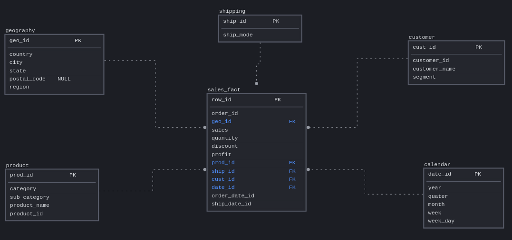

# Проекты модуля 2
---
### 2.1 Введение.
Знакомство с материалом модуля 2.

---
### 2.2 Установка Postgres.
1. Ознакомление с тапими в БД:
    * реляционные
    * не реляционные
2. Установлен Postgres.
---
### 2.3 Подключение к Базе Данных, созданрие таблицы и SQL.
1. Установка СУБД DBeaver
2. Создание 3 таблиц:
    * Таблица [Order](https://github.com/THRBY/DE-101/blob/main/Module2/2.3%20orders.sql)
    * Таблица [People](https://github.com/THRBY/DE-101/blob/main/Module2/2.3%20people.sql)
    * Таблица [Returns](https://github.com/THRBY/DE-101/blob/main/Module2/2.3%20returns.sql)
3. Написание скрипта с запросами на ответы на вопросы из модуля 1:
    * SQL запросы [superstore_data_request_script](https://github.com/THRBY/DE-101/blob/main/Module2/2.3%20superstore_data_request_script%20.sql)
---
### 2.4 ER-модели для проектирование БД.
1. Отрисовка ER-моделев в сервисе SqlDMB:
    * Концептуальная
    
    * Логическая
    
    * Физическая
    
2. Создание и заполнение смоделированых Dimensions таблицы и Sales Fact таблицы [2.4 model_sales_fact_db](https://github.com/THRBY/DE-101/blob/main/Module2/2.4%20model_sales_fact_db.sql)
---
### 2.5 База данных в облаке AWS.
1. Создание аккаунта в AWS.
2. Развертывание БД в AWS RD.
3. Подключение к БД черех DBeaver, загрузка данных из 2.3 и 2.4:
[2.5 from_stg_to_dw..sql](https://github.com/THRBY/DE-101/blob/main/Module2/2.5%20from_stg_to_dw..sql)
[2.5 stg.orders.sql](https://github.com/THRBY/DE-101/blob/main/Module2/2.5%20stg.orders.sql)
---
### 2.6 Построение дашборда по данных из облака. 
Скромный [дашборд](https://datastudio.google.com/reporting/b5ef6949-2568-4c0d-8665-320f3c0edb61) по рабочим данным. 